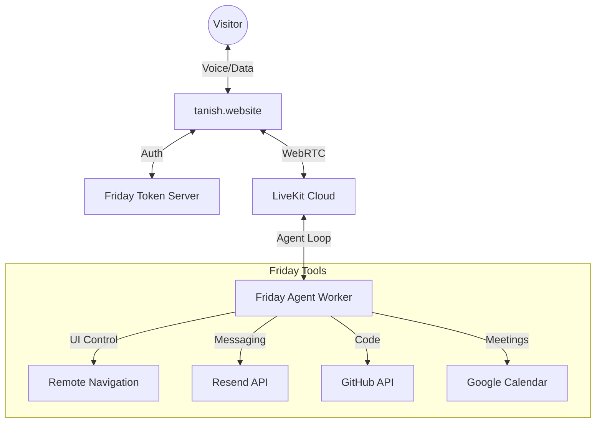

<div align="center">

  


  <br />

  [](https://python.org)
  [](https://livekit.io)
  [](https://deepgram.com)
  [](https://openai.com)
  [](https://fastapi.tiangolo.com)

  <br />

  ### Talk to Friday live at [tanish.website](https://tanish.website)
</div>

---

## Overview
Friday is a high-performance AI voice agent built to live on Tanish's portfolio. She doesn't just talk; she controls the UI, handles networking, and represents Tanish in real-time using a first-principles architecture.

## Architecture


## Quick Start

### 1. Install Dependencies
```bash
pip install -r requirements.txt
python -c "from livekit.plugins import silero; silero.VAD.load()"
```

### 2. Configure Environment
Create a `.env` file in the root directory:
```env
# LiveKit Cloud
LIVEKIT_URL=wss://your-project.livekit.cloud
LIVEKIT_API_KEY=your_livekit_api_key
LIVEKIT_API_SECRET=your_livekit_api_secret

# AI Stack (Deepgram + GPT-4o)
DEEPGRAM_API_KEY=your_deepgram_api_key
OPENAI_API_KEY=your_openai_api_key

# Tools
RESEND_API_KEY=your_resend_api_key
SENDER_EMAIL=friday@yourdomain.com
YOUR_EMAIL=tanish@youremail.com
GITHUB_USERNAME=tanishra
```

### 3. Run Locally
```bash
python main.py
```

## Remote Control Integration
Friday can "drive" your portfolio. Listen for data packets on your frontend:

```javascript
room.on(RoomEvent.DataReceived, (payload) => {
  const data = JSON.parse(new TextDecoder().decode(payload));
  if (data.type === 'NAVIGATE') {
    document.getElementById(data.section)?.scrollIntoView({ behavior: 'smooth' });
  }
});
```

---

<div align="center">
  <b>Voice-first. Agent-led. From first principles.</b>
</div>
