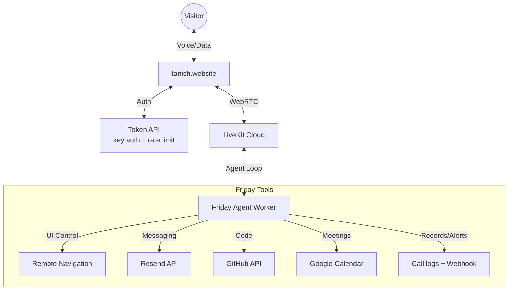

<div align="center">

  


  <br />

  [](https://python.org)
  [](https://livekit.io)
  [](https://deepgram.com)
  [](https://openai.com)
  [](https://fastapi.tiangolo.com)

  <br />

  ### Talk to Friday live at [tanish.website](https://tanish.website)
</div>

---

## Overview
Friday is an AI voice agent built to live on Tanish's portfolio. She doesn't just talk; she controls the UI, handles networking, and represents Tanish in real-time using a first-principles architecture.

Hardened for production: authenticated token minting with rate limiting, hard call-duration caps, per-call observability (transcripts, tool calls, latency metrics, token usage), outbound-relay protection, and a full pytest suite running in CI.

## Features

- **Voice pipeline:** Silero VAD → Deepgram nova-3 STT → GPT-4o-mini → Deepgram aura-2 TTS
- **Tools:** UI navigation (data channel), email, resume delivery, GitHub queries, Google Meet scheduling
- **Turn handling:** tuned endpointing, silent-visitor "still there?" nudge, auto goodbyes, 120s hard call cap
- **Observability:** per-call JSON flight recorder in `logs/calls/` + optional Slack/Discord error alerts
- **Abuse protection:** `X-Friday-Key` auth, per-IP rate limits, email validation + per-recipient caps
- **Engineering:** pinned+hashed dependency lockfile, 64-test suite, GitHub Actions CI

## Architecture

```mermaid
graph TD
    User((Visitor)) <-->|Voice/Data| Portfolio[tanish.website]
    Portfolio <-->|Auth| API[Token API<br/>key auth + rate limit]
    Portfolio <-->|WebRTC| LiveKit[LiveKit Cloud]
    LiveKit <-->|Agent Loop| Friday[Friday Agent Worker]
    
    subgraph Friday Tools
        Friday -->|UI Control| UI[Remote Navigation]
        Friday -->|Messaging| Email[Resend API]
        Friday -->|Code| GH[GitHub API]
        Friday -->|Meetings| Cal[Google Calendar]
        Friday -->|Records/Alerts| Obs[Call logs + Webhook]
    end
```

## Quick Start

### 1. Clone the repository
```bash
git clone https://github.com/tanishra/friday.git
cd friday
```

### 2. Install Dependencies
```bash
pip install -r requirements.lock    # pinned + hashed — recommended
# or: pip install -r requirements.txt   # floating ranges (dev only)
python -c "from livekit.plugins import silero; silero.VAD.load()"
```

### 3. Configure Environment
Create a `.env` file in the root directory:
```env
# LiveKit Cloud
LIVEKIT_URL=wss://your-project.livekit.cloud
LIVEKIT_API_KEY=your_livekit_api_key
LIVEKIT_API_SECRET=your_livekit_api_secret

# AI Stack (Deepgram nova-3 STT + aura-2 TTS, GPT-4o-mini)
DEEPGRAM_API_KEY=your_deepgram_api_key
OPENAI_API_KEY=your_openai_api_key

# Tools
RESEND_API_KEY=your_resend_api_key
SENDER_EMAIL=friday@yourdomain.com
YOUR_EMAIL=tanish@youremail.com
GITHUB_USERNAME=tanishra
GITHUB_TOKEN=ghp_your_github_token

# API Security
FRIDAY_API_KEY=generate-with-openssl-rand-hex-32
TOKEN_RATE_LIMIT=10/hour
API_PORT=8080

# Call limits
MAX_CALL_DURATION_SECONDS=120

# Optional — observability
ALERT_WEBHOOK_URL=            # Slack or Discord webhook for call-error alerts
LOG_RETENTION_DAYS=30         # 0 = keep call records forever
```

### 4. Run Locally
```bash
python main.py
```
Token API on `:8080` (`/health`), worker health on `:8081`.

### 5. Run Tests
```bash
pip install -r requirements-dev.txt
pytest -q          # 64 tests — external APIs mocked, no creds needed
```

## Frontend Integration

### 1. Fetch a token (requires the shared secret)

```typescript
const res = await fetch(`${API_URL}/token`, {
  method: "POST",
  headers: {
    "Content-Type": "application/json",
    "X-Friday-Key": process.env.NEXT_PUBLIC_FRIDAY_API_KEY!,
  },
  body: JSON.stringify({}),
});
const { token, livekit_url, room_name } = await res.json();
```

Set `NEXT_PUBLIC_FRIDAY_API_KEY` to the same value as the backend's `FRIDAY_API_KEY`.

Requests without the key get `403`. Each client IP is limited to 10 tokens/hour (`429` beyond that).

### 2. Remote Control
Friday can "drive" your portfolio. Listen for data packets on your frontend:

```javascript
room.on(RoomEvent.DataReceived, (payload) => {
  const data = JSON.parse(new TextDecoder().decode(payload));
  if (data.type === 'NAVIGATE') {
    document.getElementById(data.section)?.scrollIntoView({ behavior: 'smooth' });
  }
});
```

---

<div align="center">
  <b>Voice-first. Agent-led. From first principles.</b>
</div>
